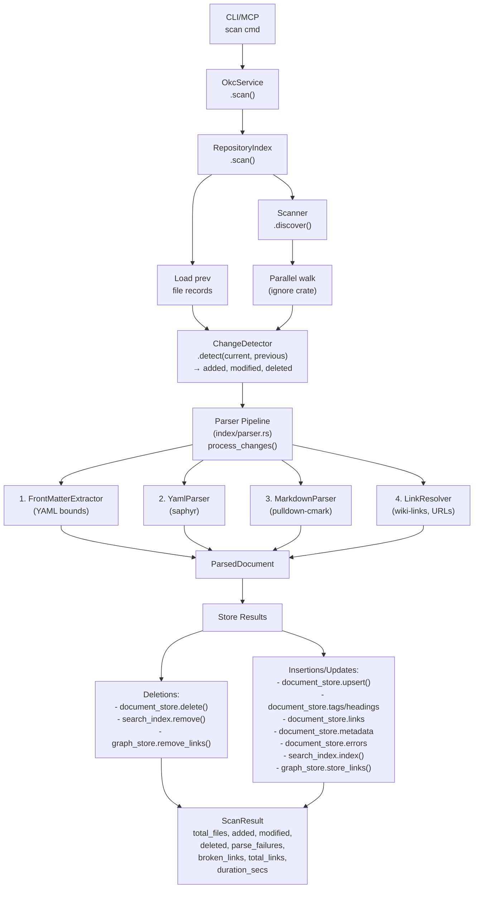
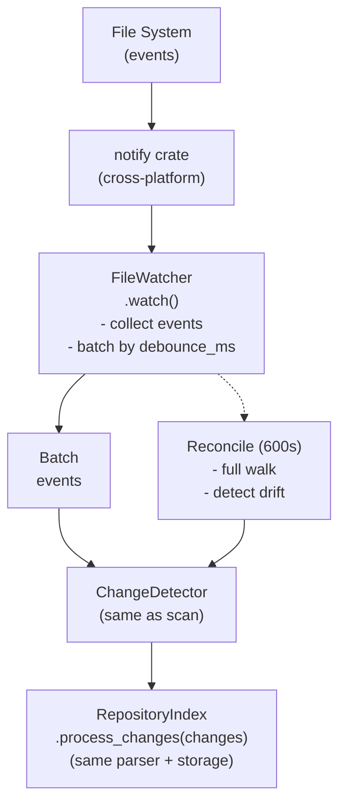
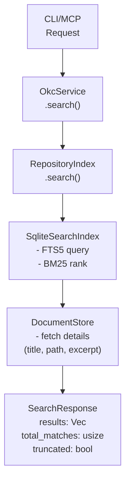
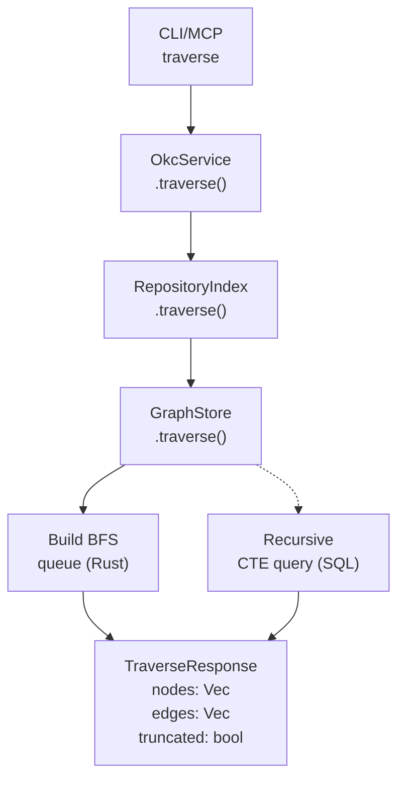
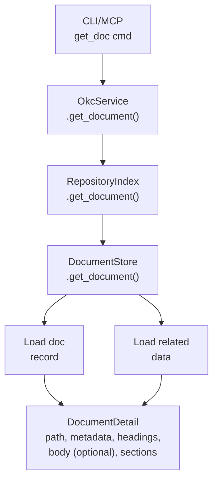
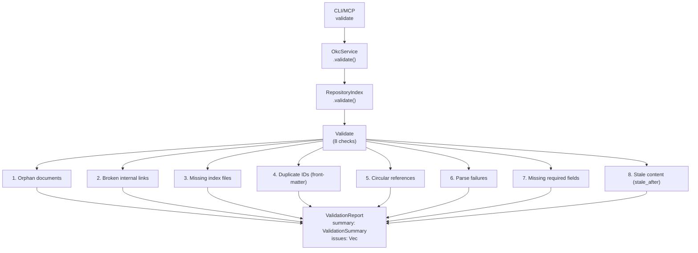
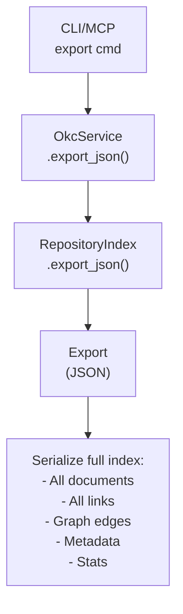

# Data Flow Documentation

## Overview

This document describes the primary data flows in the Open Knowledge Catalog system.

## 1. Full Repository Scan Flow



### Scan Data Structures

```rust
// Input: Config roots → Scanner discovers files
struct FileRecord {
    path: String,           // Relative to root
    absolute_path: String,  // Full path
    size: u64,
    modified_at: i64,       // Unix timestamp
}

// Change Detection Output
struct FileChanges {
    added: Vec<FileRecord>,
    modified: Vec<FileRecord>,
    deleted: Vec<String>,   // paths
    unchanged: Vec<FileRecord>,
}

// Parser Output (per file)
struct ParsedDocument {
    path: String,
    parent_path: String,
    title: Option<String>,
    concept_type: Option<String>,
    description: Option<String>,
    markdown_body: String,
    body_text: String,      // Plain text for search
    size: u64,
    modified_at: i64,
    content_hash: String,   // Blake3
    parse_status: ParseStatus,
    headings: Vec<HeadingInfo>,
    links: Vec<LinkInfo>,
    tags: Vec<String>,
    custom_fields: HashMap<String, String>,
    parse_errors: Vec<ParseError>,
}

// Storage Input
struct DocumentRecord {
    id: i64,
    path: String,
    parent_path: String,
    title: Option<String>,
    concept_type: Option<String>,
    description: Option<String>,
    body_text: String,
    file_size: u64,
    modified_at: i64,
    content_hash: String,
    parse_status: String,   // "ok" | "partial" | "failed"
}
```

## 2. Incremental Watch Flow



## 3. Search Flow



### Search Query Building

```rust
// Input: user query + filters
struct SearchQuery {
    query: String,              // "async await"
    path_prefix: Option<String>, // "src/"
    types: Option<Vec<String>>,  // ["concept", "api"]
    tags: Option<Vec<String>>,   // ["rust", "async"]
    limit: usize,                // 20
}

// FTS5 Query String Construction
fn build_fts5_query(q: &SearchQuery) -> String {
    let mut parts = vec![];
    
    // Main query with prefix matching
    parts.push(q.query.split_whitespace()
        .map(|t| format!("{}*", t))
        .collect::<Vec<_>>()
        .join(" "));
    
    // Path prefix filter (if supported via column)
    if let Some(prefix) = &q.path_prefix {
        parts.push(format!("path:{}*", prefix));
    }
    
    // Type filter via metadata join (not FTS5)
    // Handled in queries.rs via SQL JOIN
    
    parts.join(" ")
}

// BM25 Ranking with Field Weights
// bm25(table, title_w, desc_w, headings_w, body_w, type_w)
const BM25_WEIGHTS: &[f64] = &[10.0, 5.0, 2.0, 1.0, 0.0];
```

## 4. Graph Traversal Flow



### Traversal Algorithm (BFS with Depth Limit)

```rust
struct TraverseParams {
    start: String,
    relations: Vec<String>,  // Filter by relation type (future)
    max_depth: usize,        // Default: 3
    max_nodes: usize,        // Default: 50
}

fn traverse(&self, params: &TraverseParams) -> Result<TraverseResponse> {
    let mut visited = HashSet::new();
    let mut queue = VecDeque::new();
    let mut nodes = Vec::new();
    let mut edges = Vec::new();
    
    queue.push_back((params.start.clone(), 0));
    visited.insert(params.start.clone());
    
    while let Some((path, depth)) = queue.pop_front() {
        if depth >= params.max_depth || nodes.len() >= params.max_nodes {
            break;
        }
        
        // Get document metadata
        if let Some(doc) = self.document_store.get_document(&path)? {
            nodes.push(TraverseNode {
                path: path.clone(),
                title: doc.title,
                concept_type: doc.concept_type,
                depth,
            });
        }
        
        // Get outgoing links
        let links = self.graph_store.get_links(&path)?;
        for link in links {
            if let Some(target) = &link.target_path {
                if visited.insert(target.clone()) {
                    edges.push(GraphEdge {
                        source: path.clone(),
                        target: target.clone(),
                        relation: link.target_anchor.unwrap_or_else(|| "links_to".into()),
                    });
                    queue.push_back((target.clone(), depth + 1));
                }
            }
        }
    }
    
    Ok(TraverseResponse { nodes, edges, truncated: nodes.len() >= params.max_nodes })
}
```

## 5. Document Retrieval Flow



### Section Extraction

```rust
fn get_section(&self, path: &str, heading: &str, max_chars: usize) 
    -> Result<Option<(String, String)>> 
{
    let doc = self.get_document(path, &[], max_chars)?;
    
    // Find heading by title or anchor
    let target_heading = doc.headings.iter()
        .find(|h| h.title == heading || h.anchor.as_deref() == Some(heading));
    
    if let Some(h) = target_heading {
        // Extract body text between this heading and next same/higher level
        let start = h.position;
        let end = doc.headings.iter()
            .find(|h2| h2.position > start && h2.level <= h.level)
            .map(|h2| h2.position)
            .unwrap_or(doc.body_text.len());
        
        let content = &doc.body_text[start..end.min(start + max_chars)];
        Ok(Some((h.title.clone(), content.to_string())))
    } else {
        Ok(None)
    }
}
```

## 6. Validation Flow



## 7. Export Flow (JSON)



## Data Flow Summary Table

| Flow | Entry Point | Core Module | Storage Access | Output |
|------|-------------|-------------|----------------|--------|
| Full Scan | CLI `scan` / MCP `scan` | `RepositoryIndex::scan()` | Read + Write | `ScanResult` |
| Incremental Watch | File system events | `FileWatcher` → `RepositoryIndex::process_changes()` | Read + Write | Updated index |
| Search | CLI `search` / MCP `search` | `SearchIndex::search()` | Read (FTS5) | `SearchResponse` |
| Graph Traverse | CLI `traverse` / MCP `traverse` | `GraphStore::traverse()` | Read (links table) | `TraverseResponse` |
| Get Document | CLI `get` / MCP `get_document` | `DocumentStore::get_document()` | Read (documents + related) | `DocumentDetail` |
| Get Section | CLI `section` / MCP `get_section` | `DocumentStore` + body slicing | Read | `(heading, content)` |
| Browse | CLI `browse` / MCP `browse` | `queries::browse_directory()` | Read (documents + parent_path index) | `BrowseResponse` |
| Metadata Query | CLI `metadata` / MCP `query_metadata` | `queries::query_metadata()` | Read (documents + metadata_fields) | `MetadataQueryResponse` |
| Validate | CLI `validate` / MCP `validate` | `validate::validate_repository()` | Read (all tables) | `ValidationReport` |
| Export | CLI `export` / MCP (future) | `export::export_to_json()` | Read (all tables) | `serde_json::Value` |

## Error Handling in Data Flows

All flows use `anyhow::Result<T>` with context:

```rust
// Scanner
Scanner::discover(&config)
    .context("Failed to discover files in roots")?;

// Parser
process_changes(&config, &changes, &known_paths)
    .context("Failed to process file changes")?;

// Storage
self.document_store.upsert_document(&doc_record)
    .with_context(|| format!("Failed to upsert document: {}", doc_record.path))?;

// Service
Ok(SearchResponse { ... })  // Wraps storage errors with context
```

## Concurrency Model

| Component | Concurrency |
|-----------|-------------|
| Scanner (walker) | `rayon` parallel walk |
| Parser | Sequential per file (could parallelize) |
| SQLite connections | One per store (doc, search, graph) + main |
| Service methods | `&mut self` for scan, `&self` for reads |
| MCP server | `Arc<Mutex<OkcService>>` for shared access |
| File watcher | Dedicated thread, debounced batch → service |