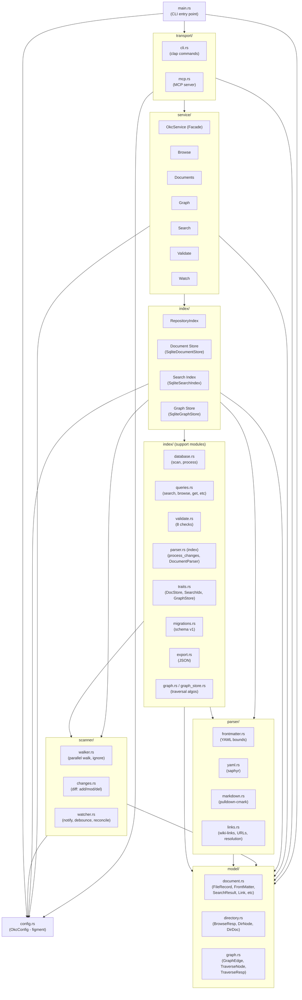
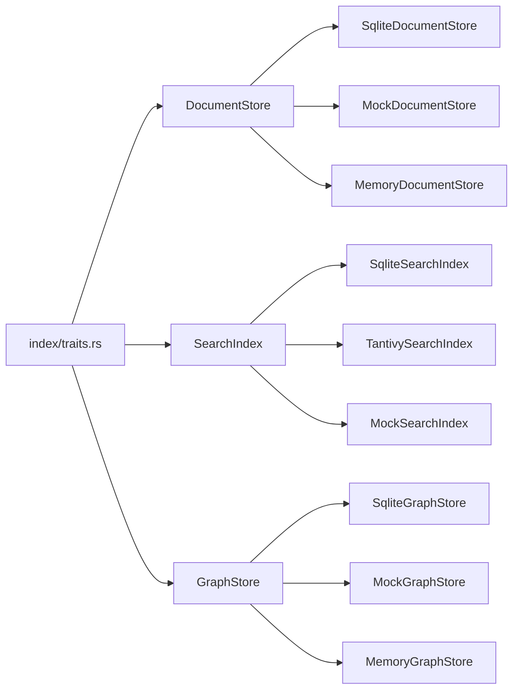

# Module Dependency Diagram

## Overview

This document shows the module dependencies in the Open Knowledge Catalog crate. Arrows indicate "depends on" (uses types/functions from).



## Dependency Matrix

| Module | config | model | parser | scanner | index | service | transport |
|--------|--------|-------|--------|---------|-------|---------|-----------|
| **config** | - | - | - | - | - | - | - |
| **model** | - | - | - | - | - | - | - |
| **parser** | - | ✓ | - | - | - | - | - |
| **scanner** | ✓ | ✓ | - | - | - | - | - |
| **index** | ✓ | ✓ | ✓ | ✓ | - | - | - |
| **service** | ✓ | ✓ | - | - | ✓ | - | - |
| **transport** | ✓ | ✓ | - | - | - | ✓ | - |
| **main** | ✓ | ✓ | - | - | - | ✓ | ✓ |

## Key Dependency Rules

1. **config** - No dependencies (leaf)
2. **model** - No dependencies (leaf, pure data types)
3. **parser** - Depends on `model` (outputs `ParsedDocument` with model types)
4. **scanner** - Depends on `config` (exclude patterns, limits), `model` (`FileRecord`)
5. **index** - Depends on `config`, `model`, `parser`, `scanner` (orchestrates scan)
6. **service** - Depends on `config`, `model`, `index` (facade over RepositoryIndex)
7. **transport** - Depends on `config`, `model`, `service` (CLI/MCP expose service)
8. **main** - Depends on all (composition root)

## Trait Boundaries (for Testing/Swapping)



Service layer uses `RepositoryIndex` which composes trait objects:
```rust
pub struct RepositoryIndex {
    document_store: Box<dyn DocumentStore>,
    search_index: Box<dyn SearchIndex>,
    graph_store: Option<Box<dyn GraphStore>>,
    ...
}
```

## Circular Dependency Prevention

- **No cycles**: Dependency graph is a DAG (topological order: config → model → parser/scanner → index → service → transport → main)
- **Traits in index/**: Break implementation cycles (index defines traits, implements them)
- **Parser in index/**: `index/parser.rs` is distinct from `parser/` module - it's the orchestration layer that uses `parser/` modules

## Feature Flags (Future)

```toml
[features]
default = ["sqlite", "mcp"]
sqlite = ["rusqlite", "sqlite-fts5"]
postgres = ["sqlx", "postgres"]
tantivy = ["tantivy"]
mcp = ["rmcp", "tokio"]
cli = ["clap"]
watch = ["notify"]
```