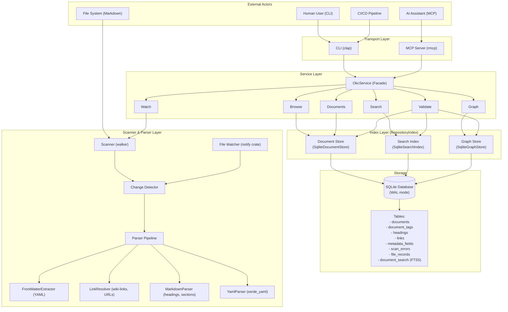
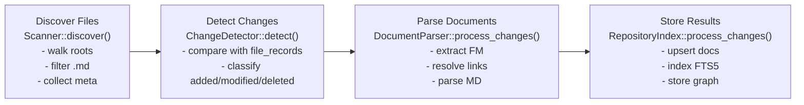
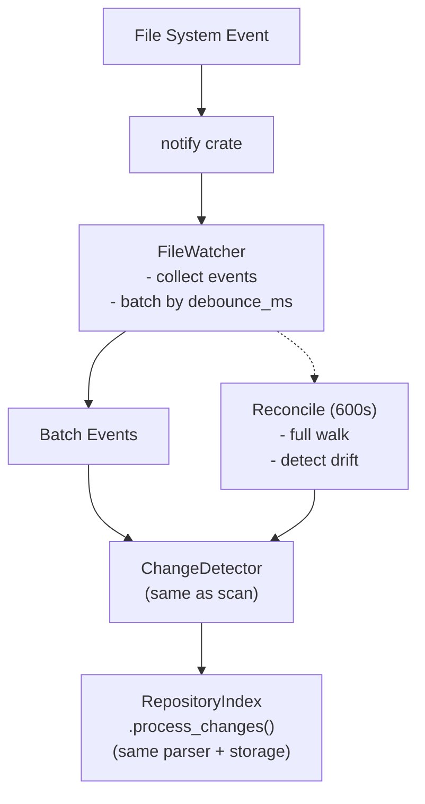
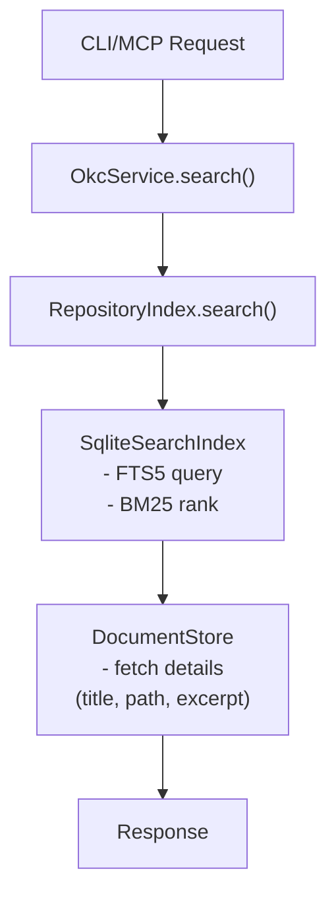

# Open Knowledge Catalog - Architecture Overview

## System Context

The Open Knowledge Catalog (OKC) is a markdown knowledge base indexer and query engine. It scans directories of markdown files with YAML front-matter, builds a searchable index with full-text search and graph navigation, and exposes the data via CLI and MCP (Model Context Protocol) server for AI assistant integration.



## Module Boundaries

| Module | Responsibility | Key Types |
|--------|---------------|-----------|
| `config` | Configuration types and defaults | `OkcConfig` |
| `model` | Core data structures | `Document`, `Link`, `GraphEdge`, `SearchResult` |
| `parser` | Markdown/YAML/front-matter/link parsing | `DocumentParser`, `LinkResolver` |
| `scanner` | Filesystem discovery, change detection, watching | `Scanner`, `ChangeDetector`, `FileWatcher` |
| `index` | Storage layer: SQLite, FTS5, Graph, Traits | `RepositoryIndex`, `SqliteDocumentStore`, `SqliteSearchIndex`, `SqliteGraphStore` |
| `service` | High-level API for CLI/MCP | `OkcService` (Browse, Documents, Graph, Search, Validate, Watch) |
| `transport` | CLI commands, MCP server | `Cli`, `McpServer` |

## Data Flow

### Scan Pipeline (Full Index)



### Incremental Watch Flow



### Query Flow (Search Example)



## Key Abstractions

### Storage Traits (`index/traits.rs`)

```rust
pub trait DocumentStore {
    fn upsert_document(&self, doc: &DocumentRecord) -> Result<()>;
    fn get_document(&self, path: &str) -> Result<Option<DocumentRecord>>;
    fn delete_document(&self, path: &str) -> Result<()>;
    // ... tags, headings, links, metadata, errors
}

pub trait SearchIndex {
    fn index_document(&self, doc: &SearchableDocument) -> Result<()>;
    fn remove_document(&self, path: &str) -> Result<()>;
    fn search(&self, query: &SearchQuery) -> Result<SearchResponse>;
}

pub trait GraphStore {
    fn store_links(&self, source: &str, links: &[Link]) -> Result<()>;
    fn remove_links(&self, source: &str) -> Result<()>;
    fn get_links(&self, path: &str) -> Result<Vec<GraphEdge>>;
    fn get_backlinks(&self, path: &str, limit: usize) -> Result<Vec<GraphEdge>>;
    fn traverse(&self, params: &TraverseParams) -> Result<TraverseResponse>;
}
```

This allows swapping backends (e.g., SQLite → PostgreSQL, FTS5 → Tantivy) without changing the service layer.

### Parser Pipeline (`index/parser.rs`)

```rust
pub struct ParsedDocument {
    pub path: String,
    pub parent_path: String,
    pub title: Option<String>,
    pub concept_type: Option<String>,
    pub description: Option<String>,
    pub tags: Vec<String>,
    pub markdown_body: String,
    pub body_text: String,           // Plain text for search
    pub headings: Vec<HeadingInfo>,
    pub links: Vec<LinkInfo>,
    pub custom_fields: HashMap<String, serde_json::Value>,
    pub parse_status: ParseStatus,
    pub parse_errors: Vec<ParseError>,
    pub size: u64,
    pub modified_at: i64,
    pub content_hash: String,
}
```

## Concurrency Model

- **SQLite WAL mode**: Multiple readers, single writer
- **Service layer**: `Arc<Mutex<OkcService>>` for MCP (single-threaded async)
- **Scanner**: Rayon parallel walker for file discovery
- **Parser**: Sequential per-file (CPU-bound, low contention)

## Configuration

All configuration via `OkcConfig`:
- Root directories to scan
- Exclude patterns (glob)
- Size limits (file, front-matter)
- Graph traversal limits
- Database path
- Watcher debounce/reconcile intervals

## Security Boundaries

1. **Path confinement**: All operations restricted to configured roots
2. **Symlink policy**: Configurable (default: deny)
3. **Size limits**: Max file size, max front-matter size
4. **Excluded directories**: `.git/`, `node_modules/`, `target/`, `.env*`, `secrets/`, `credentials/`
5. **Read-only by default**: No write operations via MCP/CLI except index management
6. **No shell access**: Pure Rust implementation

## Deployment

- Single binary (`okc`) with embedded SQLite
- Database file: `okc_index.db` (configurable)
- MCP server: stdio transport (JSON-RPC over stdin/stdout)
- No external dependencies at runtime