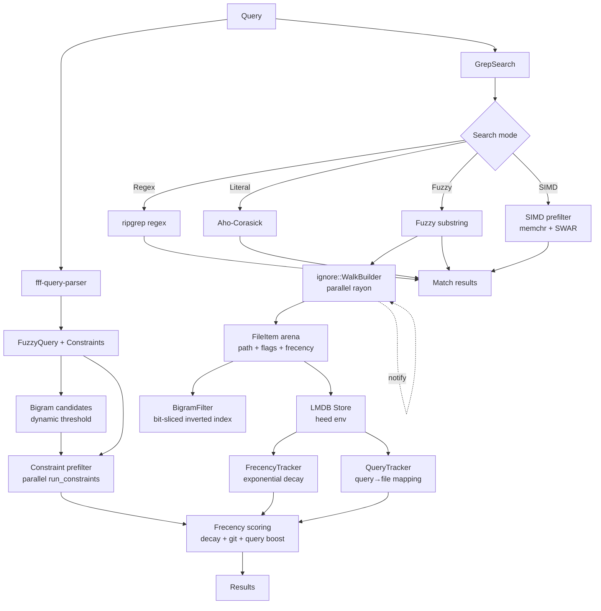

# Competitor Assessment: fff (dmtrKovalenko/fff)

**Date:** 2026-07-27
**Author:** OKC-00096
**Status:** Draft

## Overview

[fff](https://github.com/dmtrKovalenko/fff) is an MIT-licensed Rust workspace (v0.10.1)
that originated as a fast file finder and has evolved into a full codebase search engine
with MCP server, Neovim integration, and a C CLI. It combines frecency-ranked fuzzy file
search, multi-mode content grep (SIMD-accelerated), a bigram-inverted path index for
repository-scale performance, and LMDB-backed persistence for frecency tracking and query
history. The author is dmtrKovalenko.

Where OKC is a structured, database-backed knowledge catalog with typed concepts, YAML
front-matter, MCP transport, and bounded OKF conventions, fff is an unstructured
file-system search engine optimised for developer workflow efficiency. fff prioritises
fast fuzzy file finding + content search with frecency boost, while OKC prioritises
structured metadata querying, graph-based navigation, and agent-facing tooling over
typed knowledge.

### Similarities

- Both are Rust codebase search tools with MCP transport
- Both support fuzzy file finding and content grep
- Both have persistent indexing (fff: LMDB, OKC: SQLite+FTS5)
- Both support file watching/background scanning
- Both target AI agents via MCP server (stdio transport)
- Both are fully local (no external services)
- Both prefer single-binary deployment via `cargo install`

### Differences

| Dimension | fff | OKC |
|-----------|-----|-----|
| **Core purpose** | File finder + content grep | Knowledge catalog + structured graph |
| **Knowledge model** | None (flat file paths + content) | OKF concepts (typed, YAML front-matter) |
| **Search approach** | Frizbee fuzzy + bigram prefilter + SIMD grep | SQLite FTS5 (BM25) + structured metadata query |
| **Ranking** | Frecency (exponential decay + git status + query combo) | BM25 relevance score |
| **File path search** | Bigram inverted index (bit-sliced, SIMD-accelerated) | SQLite LIKE / FTS5 on path column |
| **Content grep modes** | 4: regex (ripgrep), aho-corasick, fuzzy substring, SIMD prefilter | FTS5 MATCH only |
| **Storage** | LMDB (heed) — opaque, no SQL | SQLite (rusqlite) + FTS5 — queryable |
| **Persistence** | Freqency + query histories + scan state | Full document index + metadata + links + headings |
| **Graph/taxonomy** | None | Typed concepts, bidirectional links, headings |
| **Metadata query** | Constraint prefilter (path/name/ext/glob/regex) | Structured query on YAML fields (type, tags, dates) |
| **Section extraction** | ❌ | ✅ `get_section` |
| **Validation** | ❌ | ✅ 8-category OKF validation |
| **Lineage** | ❌ | ✅ `lineage` tool |
| **MCP Transport** | stdio only | stdio + HTTP + SSE |
| **MCP Tools** | 16 tools (file-finding + grep + Neovim context) | 11 tools (catalog + graph + search) |
| **File mutation** | ❌ Read-only | ❌ Read-only |
| **Neovim integration** | ✅ Native Lua plugin (FzfLua) | ❌ |
| **Query grammar** | `name:/path:/ext:/glob:!/and:/or:` constraints | Structured JSON filters |
| **C CLI / FFI** | ✅ fff-c (C CLI + libffi) | ❌ |
| **Python bindings** | ✅ fff-python | ❌ |
| **Export formats** | ❌ | ❌ |
| **File watching** | notify-based watcher | notify + debounce |

### Architecture

fff's workspace has 7 members, reflecting a componentised architecture:

```
fff (workspace root)
├── fff-core/          # Core library: FilePicker, frecency, bigram index, grep, walk, constraints
├── fff-mcp/           # MCP server (16 tools, stdio transport)
├── fff-c/             # C CLI binary + FFI library
├── fff-nvim/          # Neovim Lua plugin (FzfLua integration)
├── fff-python/        # Python bindings (PyO3)
├── fff-query-parser/  # Single-pass query parser → FuzzyQuery + Constraint list
└── fff-grep/          # Simplified grep-searcher wrapper (byte-slice line search)
```

The core data flow is:

1. **Background scan** (`SharedFilePicker::pickup()`): walks directory tree via `ignore::WalkBuilder`
   (respecting `.gitignore`, max depth, follow symlinks) in parallel via rayon. Collects `FileItem`
   records (arena-id path + frecency + git-status flags + type flags).

2. **Bigram index build** (`BigramFilter::build_inverted_index`): parallel inverted index over all
   scanned file paths. Each file path is decomposed into bigrams mapped to bit-sliced columns
   (AHashMap<bigram, AtomicU16>), capped at 5000 columns. For >500k files: two-pass long-content
   handling. SIMD column merge via u64 bitwise AND/OR operations.

3. **Frecency tracking** (`FrecencyTracker`): LMDB-backed per-file timestamps deque. Scoring uses
   exponential decay with configurable half-life (λ=ln2/10days normal, λ=ln2/3days AI mode).
   Modification recency bonus with 5 compressed thresholds in AI mode. Git-status dirtiness boost
   (+0.1x). Query-combination boost (+0.2x per matched query term in query history).

4. **Query parsing** (`fff-query-parser`): single-pass parser producing a `FuzzyQuery` + `Constraint`
   list. Supports `name:`, `path:`, `ext:`, `glob:`, `!` (negation), `and:`, `or:` prefixes plus
   `type:git` for git-status filter. Config types support `FileSearchConfig`, `GrepConfig`,
   `MixedSearchConfig`, `AiGrepConfig`, `DirSearchConfig`.

5. **Search path** (`FilePicker::search()`): parse query → bigram candidate reduction (dynamic
   threshold per query length, prescreen pass) → constraint prefilter (parallel `run_constraints`
   for >10k items, SmallVec-optimized OR/AND chains) → frecency-score candidates → top-N results.

6. **Grep path** (`FilePicker::grep()`): parse query → file list → GrepSearch with 4 modes:
   - ripgrep regex mode (via `grep-regex` + `grep-searcher` crates)
   - aho-corasick multi-literal mode (fast for common strings)
   - fuzzy substring mode
   - SIMD-accelerated prefilter (`memchr` + SWAR techniques)
   File-level parallelism via rayon. Per-file match limiting + context lines.

### Pipeline Diagram



### Frecency Scoring Formula

The `match_and_score` function in `fff-core/src/score.rs` computes:

```
raw_score = frizbee_fuzzy_score(path, query)  // 0-100+ from fuzzy-matcher
frecency_boost = exp(-elapsed_seconds * ln(2) / half_life_seconds)
  where half_life = 10 days (normal) or 3 days (AI mode)
mod_recency_bonus = tiered bonus if file modified recently (5 compressed thresholds in AI mode)
git_boost = 1.0 (clean) or 1.1 (dirty/modified/untracked)
query_combo_boost = 1.0 + 0.2 × matched_query_count

score = raw_score × frecency_boost × git_boost × query_combo_boost + mod_recency_bonus
```

## MCP Surface

fff provides 16 MCP tools over stdio transport (via `--mcp` flag on the binary). The server
uses cursor-based pagination (CursorStore) and Perplexity-style source enumeration.

| Tool | Description | OKC Equivalent |
|------|-------------|----------------|
| `find_files` | Bigram+constraint file search, cursor pagination | `browse` (limited) |
| `grep` | Content search with multi-mode, smart_action integration | `search` |
| `multi_grep` | OR-content search across patterns | ❌ |
| `smart_action` | Combined file+grep+read in one call | ❌ |
| `read_file` | Read file contents | `get_document` |
| `get_file_info` | File metadata (size, modified, type) | ❌ |
| `glob` | Glob pattern matching | ❌ |
| `list_directory` | List directory entries | `browse` |
| `get_db_health` | LMDB health (pending/healthy/degraded) | ❌ |
| `cwd` | Get current working directory | ❌ |
| `open_file` | Open file in editor | ❌ |
| `custom_grep` | Ad-hoc grep with custom params | ❌ |
| `view_source_code` | View source with syntax context | ❌ |
| `trigger_rescan` | Force filesystem rescan | `scan` |
| `get_buf_info` | Current Neovim buffer info | ❌ |
| `vim_get_cwd` | Neovim's current working directory | ❌ |

**Key observations:**

- fff's MCP surface is file-system focused, not catalog/knowledge focused
- `smart_action` is notably agent-friendly — it returns file paths, grep matches, and file previews in a single structured response with Perplexity-style `## Source: ...` sections
- The Neovim context tools (`get_buf_info`, `vim_get_cwd`) are unique — no other competitor provides editor context to MCP agents
- No HTTP transport — stdio only (limiting for remote agent scenarios)
- No resources, no prompts — pure tools-only MCP server
- Cursor-based pagination is well-designed for large result sets

## Feature Comparison

| Feature | fff | OKC | Notes |
|---------|-----|-----|-------|
| Fuzzy file search | ✅ Bigram-indexed, frecency-ranked | ⚠️ Basic FTS5 path search | fff is significantly better |
| Content grep | ✅ 4 modes + SIMD prefilter | ✅ FTS5 MATCH | fff has more modes, OKC has structured search |
| Structured metadata query | ❌ Constraint prefilter only | ✅ YAML field query | OKC strength |
| Graph traversal | ❌ | ✅ BFS + backlinks | OKC-only |
| Section extraction | ❌ | ✅ `get_section` | OKC-only |
| File watching | ✅ notify-based | ✅ notify + debounce | Both solid |
| MCP transport | stdio only | stdio + HTTP + SSE | OKC broader |
| Persistent index | ✅ LMDB | ✅ SQLite+FTS5 | Different tradeoffs |
| Frecency ranking | ✅ Exponential decay + git boost | ❌ | fff unique |
| Bigram path index | ✅ SIMD-accelerated | ❌ | fff unique |
| Neovim integration | ✅ Native Lua plugin | ❌ | fff unique |
| C CLI / FFI | ✅ fff-c | ❌ | fff unique |
| Python bindings | ✅ PyO3 | ❌ | fff unique |
| Query grammar | `name:/path:/ext:/glob:!` | Structured JSON | Different styles |
| Validation | ❌ | ✅ 8-category | OKC-only |
| Lineage/History | ❌ | ✅ `lineage` tool | OKC-only |
| OKF format | ❌ | ✅ OKF v0.2 | OKC-only |
| Export formats | ❌ | ❌ | Neither |
| File mutation | ❌ | ❌ | Neither |
| Agent onboarding | ❌ | ❌ | Neither |

## Strengths

1. **Frecency ranking is genuinely useful.** The exponential decay model with configurable half-life
   (10-day normal, 3-day AI mode) means frequently accessed files naturally rise to the top.
   Combined with git-status boost (+0.1x) and query-combo boost (+0.2x per term), the ranking
   produces remarkably intuitive results for developer workflows.

2. **Bigram-indexed path search scales to very large repositories.** The bit-sliced inverted index
   design with 5000 columns supports ~500k files in ~305MB of memory. The dynamic threshold per
   query length and prescreen pass ensure sub-ms candidate reduction even at repo scale. SIMD
   column merge using u64 bitwise AND/OR is well-optimized.

3. **Four-mode grep with SIMD prefilter is best-in-class.** fff's content search supports regex
   (via ripgrep's `grep-regex`), multi-literal (aho-corasick), fuzzy substring, and SIMD prefilter
   (memchr + SWAR) modes. The file-level parallelism via rayon and per-file match limiting make it
   practical for repository-wide searches.

4. **Well-designed MCP surface with agent-friendly features.** The `smart_action` tool with
   Perplexity-style `## Source:` sections, cursor-based pagination, and clear tool descriptions
   shows deliberate agent-oriented design. The tool set covers the full file-search → read → open
   workflow.

5. **Neovim integration is deep and native.** The Lua plugin integrates with FzfLua and exposes
   buffer context via MCP tools (`get_buf_info`, `vim_get_cwd`). This editor-awareness is unique
   among the assessed competitors.

6. **Expressivde constraint grammar.** The query parser's `name:/path:/ext:/glob:!/and:/or:`
   prefixes provide a concise, composable way to narrow searches without JSON.

7. **Componentised architecture with multiple language bindings.** The workspace split enables
   independent reuse: C CLI/FFI (`fff-c`), Python bindings (`fff-python`), Neovim plugin
   (`fff-nvim`), and MCP server (`fff-mcp`) all build on `fff-core`.

8. **All-Rust, single binary deployment.** No external dependencies, no runtime, no service to
   install — `cargo install fff-search` is the single deployment command.

## Weaknesses

1. **No structured knowledge model.** fff treats files as opaque blobs identified by path. There
   is no concept type, no front-matter parsing, no tags, no cross-document relationships, and no
   content structure awareness. It cannot answer "give me all documents tagged 'architecture'".

2. **No graph traversal or link tracking.** fff has no awareness of document links, backlinks,
   or cross-references. Every search result is an independent file hit. It cannot follow a chain
   of related documents.

3. **No document structure extraction.** fff cannot extract sections, headings, or structured
   content from files. Its content search returns flat line matches with context lines, not
   structured excerpt regions.

4. **No validation or linting.** There is no validation of file content, front-matter, or links.
   fff indexes whatever it finds in the filesystem without any quality checks.

5. **LMDB storage is opaque.** Unlike OKC's SQLite database which supports ad-hoc queries via
   standard SQL, fff's LMDB store is a key-value database with no queryable schema. Debugging
   or inspecting the index requires the fff API.

6. **Stdio-only MCP transport.** No HTTP, no SSE, no WebSocket. This limits deployment options
   for remote agent scenarios or containerised environments.

7. **Bigram index is ephemeral.** The bigram path index is rebuilt on every rescan, not stored
   persistently. For large repositories (>100k files), the rebuild cost is noticeable.

8. **Read-only.** fff cannot create, edit, or delete files. It is a pure search tool with no
   mutation capabilities.

9. **Dependency on Neovim for some MCP tools.** The `get_buf_info` and `vim_get_cwd` tools
   require a running Neovim instance. They fail or return empty results outside Neovim, which
   is not clearly documented in tool descriptions.

10. **No export or formatting options.** Results are returned in fff's structured format only.
    No CSV, TSV, JSON export, or custom formatting.

## Threat Assessment

| Dimension | Rating | Rationale |
|-----------|--------|-----------|
| **Direct overlap** | 🟡 Medium | Gaps: metadata query, graph, section extraction, OKF, validation, export, HTTP transport |
| **Search quality** | 🟠 Significant | fff's bigram-indexed path search + frecency + 4-mode grep is better than OKC's file search |
| **Agent readiness** | 🟡 Medium | fff's MCP design is thoughtful but lacks resources, prompts, HTTP transport, structured data model |
| **Ecosystem** | 🟢 Low | fff has ~1.7k GitHub stars, focused user base, Neovim community. Not a direct competitive threat. |
| **Architecture** | 🟢 Low | fff is a file finder, not a knowledge catalog. Fundamental architectural difference. |

### Threat Summary

fff is **not a direct competitor** to OKC in the knowledge-catalog space. Its core identity
is a file-system search engine optimised for developer workflow, not a structured knowledge
base for AI agents. However, it poses a **medium-threat overlap** in the "fast file search
+ grep for AI agents via MCP" niche, where fff's MCP tools cover file finding and content
search more thoroughly than OKC's current MCP surface.

### What fff does better than OKC

- File path search (bigram index + frecency ranking)
- Content grep (4 modes vs FTS5-only)
- Query grammar (concise constraint prefixes vs JSON filters)
- MCP tools for file-system operations (glob, file info, read_file, open_file)
- Agent-friendly `smart_action` combined tool
- Neovim integration
- C CLI + Python bindings

### What OKC does better than fff

- Structured knowledge model (OKF concepts, types, tags)
- Graph traversal and backlinks
- Section/heading extraction
- Structured metadata query (YAML field query)
- Validation and linting
- Lineage/history tracking
- HTTP + SSE transport for MCP
- Broader MCP tool scope (search, traverse, query, browse, validate, lineage)

## Recommendations for OKC

### Priority: Medium

fff demonstrates that **frecency-ranked file search with bigram-indexed paths** is a valuable
pattern for codebase search tools. OKC should evaluate adopting similar techniques while
maintaining its structured-knowledge differentiator.

### Specific actions

1. **Evaluate adding frecency ranking to OKC's file search.** The exponential decay model with
   configurable half-life is well-tested and provides genuinely better results than flat BM25.
   Implementing this in SQLite (timestamp table + scoring function) would be feasible.

2. **Consider a bigram prefilter for OKC's path search.** For repositories with >10k documents,
   the bigram-inverted index approach provides sub-ms candidate reduction. `sqlite-vec` or a
   lightweight in-memory bigram filter could bridge the gap without a full LMDB dependency.

3. **Adopt the `smart_action` pattern in OKC.** A combined MCP tool that returns search results
   + document previews + related backlinks in a single structured response would be valuable
   for agents. fff's Perplexity-style `## Source:` formatting is a good reference.

4. **Add a constraint grammar to OKC's search tool.** The `name:/path:/ext:/glob:!` prefix
   grammar is concise and composable. Adding similar prefix parsing to OKC's `search` MCP tool
   would improve power-user ergonomics without breaking the JSON API.

5. **Do NOT add Neovim-specific MCP tools.** Bundling editor context into the MCP server
   couples the tool to a specific editor. Instead, consider a generic `get_context` tool that
   accepts custom context from any editor/environment via environment variables or stdin.

6. **Do NOT try to compete on raw file-finding speed.** fff's bigram index + SIMD grep is the
   best-in-class for this specific use case. OKC should focus on its differentiators: structured
   knowledge, graph traversal, and agent-facing tooling.

7. **Explore a fff plugin/integration bridge.** fff's MCP server could be composed alongside
   OKC's MCP server by an agent — fff for fast file search, OKC for structured knowledge queries.
   Documenting this composition pattern would benefit users of both tools.

### What NOT to do

- Do not try to replicate fff's full grep engine — the 4-mode grep with SIMD prefilter is a
  significant engineering investment with diminishing returns for OKC's structured-document
  focus.
- Do not add Neovim-specific MCP tools that couple OKC to a specific editor.
- Do not adopt LMDB over SQLite — SQLite's queryability and ecosystem are more valuable than
  LMDB's raw write throughput for OKC's use case.
- Do not attempt a C CLI or FFI bindings — OKC's value is in the MCP server and structured
  knowledge model, not raw library embeddability.

## Verdict

fff is a well-executed, focused file-system search engine that excels at what it does: fast
frecency-ranked file finding and multi-mode content grep. Its bigram-indexed path search,
frecency ranking, SIMD-accelerated grep, and thoughtfully designed MCP surface make it the
best-in-class tool for repository-scale file search.

However, fff is **not a direct competitor** to OKC. It is a file finder with grep, not a
knowledge catalog. The two tools occupy fundamentally different niches and could even be
complementary in an agent workflow (fff for file discovery, OKC for knowledge access).

| Decision | Rationale |
|----------|-----------|
| **Not a substitute** | fff has no knowledge model, no graph, no metadata, no structured content — it cannot replace OKC |
| **Potential complement** | Agents could use fff for fast file search and OKC for structured knowledge queries |
| **Feature inspiration** | OKC should evaluate frecency ranking, bigram prefilter, smart_action pattern, and constraint grammar |
| **Threat level** | Low-Medium — overlaps on file search/grep MCP tools, but not on OKC's core value prop |

**Strategic message:** fff is to OKC what `ripgrep` is to a CMS — a fast search engine for
files, not a structured knowledge system. The overlap is at the feature level (both search
files), not at the product level (catalog vs finder). OKC should adopt the best patterns
(frecency, bigram prefilter, smart_action) while staying focused on its unique value:
structured OKF concepts, graph navigation, and agent-facing catalog tooling.
