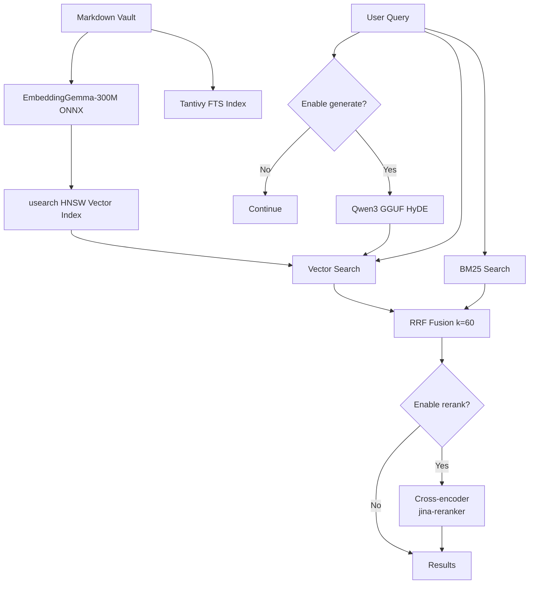

# Competitor Assessment: vagus

**Date:** 2026-07-27
**Author:** OKC-00048
**Status:** Draft

## Overview

[vagus](https://github.com/vasovagal/vagus) is a Rust CLI tool that provides hybrid
full-text + semantic search over a plain-Markdown PARA vault. It combines Tantivy BM25
retrieval with ONNX-based embeddings (EmbeddingGemma-300M) via Reciprocal Rank Fusion,
optionally re-ranked by a cross-encoder and expanded by a local GGUF LLM (Qwen3). It is
MIT-licensed, authored by Xavier Lange (xrl), and last released as v0.9.0 (July 2026).

Where OKC is a structured, database-backed knowledge catalog with typed concepts,
YAML front-matter, MCP transport, and bounded OKF conventions, vagus is a simpler
unstructured search engine for any markdown directory. vagus prioritises semantic
retrieval quality (embeddings + reranking + query expansion), while OKC prioritises
structured metadata querying, graph-based navigation, and agent-facing tooling.

### Similarities

- Both are Rust CLIs for searching plain-text markdown knowledge bases
- Both run fully local (no external services or API calls)
- Both support full-text search with ranking (BM25)
- Both operate on a local directory of markdown files
- Both support excerpt/snippet generation around matches

### Differences

| Dimension | vagus | OKC |
|-----------|-------|-----|
| **Search approach** | Hybrid BM25 + vector embeddings + RRF fusion | Pure FTS5 (BM25) |
| **Semantic search** | EmbeddingGemma-300M ONNX via fastembed | None |
| **Reranking** | Cross-encoder (jina-reranker-v1-turbo-en) | None |
| **Query expansion** | HyDE via local Qwen3 GGUF (candle) | None |
| **Vector index** | usearch HNSW (in-memory) | None |
| **Content format** | Any markdown files | OKF (structured YAML front-matter + body) |
| **Metadata query** | None (full-document only) | Structured query on YAML fields |
| **Graph/taxonomy** | None | Typed concepts, bidirectional links |
| **Storage** | Tantivy + in-memory index + usearch | SQLite (FTS5 + relational tables) |
| **Persistence** | Ephemeral (rebuilds on each run) | Persistent SQLite DB |
| **File-watch** | None | `okc watch` for live re-indexing |
| **Transport** | CLI only | CLI + MCP server + HTTP (axum) |
| **Agent focus** | Meant for human CLI use | Designed for AI agent consumption |
| **ONNX dependencies** | Yes (fastembed + ort crate) | None |
| **LLM dependencies** | Optional (candle + Qwen3 GGUF) | None |
| **Model weight downloads** | ~2-3 GB (EmbeddingGemma + reranker) | None |
| **Indexing speed** | Fast (per-file Tantivy indexing) | Fast (SQLite FTS5 indexing) |

### Hybrid Search Architecture

vagus's pipeline, as reconstructed from the source, works as follows:

1. **Indexing:** Tantivy builds an in-memory FTS index with a `SEARCH` schema (path,
   title, body). Simultaneously, `embed::create_vector_index()` runs EmbeddingGemma on
   each document via fastembed and stores 768-dim vectors in an `Index` (usearch HNSW).
   The vector index is persisted to a `.vx` file on disk.
2. **Retrieval:** On query, Tantivy BM25 and usearch HNSW search run in parallel. BM25
   results are scored by Tantivy's built-in BM25. Vector results use cosine similarity.
3. **Fusion:** `search::fuse()` in `src/search.rs:175-240` applies Reciprocal Rank
   Fusion (RRF) with k=60. The BM25 and vector rankings are interleaved by their
   reciprocal ranks.
4. **Reranking:** When `rerank` feature is enabled, the fused top-N (default 50) are
   scored by `rerank::rerank()` using a jina-reranker-v1-turbo-en cross-encoder. This
   re-scores each (query, doc) pair through the transformer, replacing the RRF score.
5. **Query Expansion:** When `generate` feature is enabled (default), the query is
   expanded via `rewrite::rewrite()` — a HyDE-style approach that uses a local Qwen3
   GGUF model (loaded via candle) to generate a hypothetical document, then appends
   its embedding to the query embedding before vector search.

### Pipeline Diagram

## Feature Comparison

| Feature | vagus | OKC | Notes |
|---------|-------|-----|-------|
| Full-text search (FTS) | Tantivy BM25 | SQLite FTS5 + BM25 | Both support weighted fields |
| Semantic / vector search | EmbeddingGemma-300M (768d) | ❌ | Major gap for OKC |
| Hybrid fusion | RRF (k=60) | ❌ | N/A since no vector search |
| Cross-encoder reranking | jina-reranker-v1-turbo-en | ❌ | Improves precision |
| Query expansion / HyDE | Qwen3 GGUF (candle) | ❌ | Improves recall |
| Path-prefix filtering | ❌ (no structured filters) | Yes | OKC supports `path_prefix` |
| Type/tag filtering | ❌ | Yes (YAML concept_type, tags) | OKC's OKF format enables this |
| Metadata queries | ❌ | Yes (JSON field projection) | OKC has structured metadata query |
| Document graph | ❌ | Yes (bidirectional links, headings) | OKC tracks cross-document links |
| File watching | ❌ | Yes (`okc watch`) | OKC has live re-indexing |
| MCP transport | ❌ | Yes (rmcp server + client) | OKC is designed for AI agents |
| HTTP API | ❌ | Yes (axum, optional) | OKC serves on localhost |
| Persistent index | ❌ (in-memory, rebuilds) | Yes (SQLite) | vagus is ephemeral |
| Local-only | ✅ (no external calls) | ✅ | Both are fully local |
| ONNX / local LLM | ✅ (EmbeddingGemma, Qwen3) | ❌ | vagus has heavy local deps |
| PARA convention | ✅ (inbox, projects, areas, resources, archives) | ❌ | OKC is OKF-based, not PARA |

## PARÁ Patterns

vagus explicitly targets the [PARÁ method](https://fortelabs.com/blog/para/) folder
structure (Projects, Areas, Resources, Archives + optional Inbox). Its design docs
(`CLAUDE.md`, `guardrails.md`) make this central: the vault is expected to follow
PARÁ conventions.

OKC does not enforce any specific folder structure. Its OKF format is content-addressed
by path with typed concepts and YAML front-matter, independent of directory layout.

**Implication:** vagus appeals directly to the Tiago Forte / PARA community. OKC
appeals to structured-knowledge users (Zettelkasten, org-mode, ontology-driven).

## Code Architecture

| Aspect | vagus | OKC |
|--------|-------|-----|
| Lines of Rust | ~2K | ~10K+ |
| Workspace structure | Single crate + 2 plugin crates | Single crate |
| Error handling | `anyhow` | `thiserror` + `anyhow` |
| Async | Minimal (std mostly) | Tokio + axum + rmcp |
| Key deps | tantivy, fastembed, usearch, candle, clap | pulldown-cmark, rusqlite, rmcp, axum, clap |
| Plugin system | vagus-plugin-protocol (via stdin/stdout JSON) | Transport-agnostic (MCP is primary) |
| Entry points | `main.rs` (CLI dispatch) | `main.rs` (CLI) + `transport/` (MCP, HTTP) |

## Strengths

1. **Semantic search is production-quality.** EmbeddingGemma-300M is a strong
   instruction-tuned embedding model (MTEB ~64), and the RRF fusion with k=60 is
   a well-tuned default. The cross-encoder reranking and HyDE query expansion push
   retrieval quality well above naive BM25.

2. **Simple and focused.** vagus does one thing (search over PARA markdown) and does
   it well. The codebase is ~2K lines, well-structured, and easy to understand.

3. **Fully local and private.** No external APIs, no telemetry, no cloud dependencies.
   The ONNX models run locally via fastembed and candle.

4. **Plugin architecture.** The `vagus-plugin-protocol` crate enables extensibility via
   stdin/stdout JSON subprocesses, similar to MCP but simpler.

## Weaknesses

1. **Ephemeral index.** vagus rebuilds its Tantivy + usearch index on every invocation.
   For large vaults, this means startup latency on every search. OKC's persistent
   SQLite index is ready instantly.

2. **No structured metadata.** vagus treats each file as an opaque blob (path + body).
   It cannot query by YAML front-matter fields, concept type, tags, or any structured
   attribute. This severely limits its usefulness for typed knowledge bases.

3. **No graph or relationship tracking.** vagus has no concept of document links,
   backlinks, or cross-references. Its results are independent document hits.

4. **Heavy dependency footprint.** fastembed pulls in ONNX Runtime (~40MB), and the
   optional candle + GGUF adds another ~30MB. EmbeddingGemma-300M is ~600MB. Users
   must download 1-3 GB of model weights.

5. **No server/daemon mode.** Every search is a CLI invocation — rebuild indices,
   load models, search, print, exit. No MCP, no HTTP, no watch mode.

6. **No AI-agent orientation.** The output is human-readable terminal text, not
   structured JSON. No tool descriptions, no schema generation, no agent-friendly
   protocol.

## Recommendations for OKC

### Priority: Medium-High
vagus demonstrates that semantic search is feasible and valuable for local knowledge
bases. OKC should evaluate closing the semantic-search gap while preserving its
structured-data strengths.

### Specific actions

1. **Evaluate adding vector search as an optional feature.** Use `fastembed` (already
   Rust-ecosystem-compatible) or `ort` directly to support ONNX embedding models.
   Feature-gate it so OKC remains lightweight when not needed.

2. **Keep structured metadata as the differentiator.** Do not try to be "vagus but
   better" — the hybrid semantic search is vagus's strength. OKC's differentiator is
   structured OKF concepts, typed schemas, graphs, and agent tooling. The two styles
   could even be complementary (use vagus for full-text retrieval, OKC for structured
   access).

3. **Consider an RRF-based hybrid fusion path.** If vector embeddings are added to
   OKC, model the fusion on vagus's approach (RRF k=60) — it is simple, well-tested,
   and does not require score normalisation.

4. **Do not add local LLM inference.** candle + GGUF for query expansion adds
   complexity, weight downloads, and GPU/CPU overhead disproportionate to the value
   for a catalog tool. If query expansion is needed, offer it as a plugin hook.

5. **Explore a vagus plugin bridge.** Since vagus supports stdin/stdout JSON plugins,
   OKC could theoretically implement a vagus plugin that delegates structured queries
   to OKC. This would enable a "search PARA vault with OKC metadata" workflow without
   building everything in-house.

### What NOT to do

- Do not add a full local LLM (candle/Qwen) — the maintenance burden is high and the
  value for a catalog tool is marginal.
- Do not abandon the persistent SQLite index for an in-memory approach — instant
  startup is critical for agent tooling.
- Do not try to enforce any folder convention (PARA or otherwise) — OKF is
  path-agnostic and that flexibility is valuable.

## Verdict

vagus is a well-executed, focused tool for semantic search over PARA markdown vaults.
Its hybrid BM25 + embedding + reranking + HyDE pipeline represents a mature approach
to local retrieval quality. However, it is not a direct competitor to OKC: vagus
optimises for retrieval quality over unstructured text, while OKC optimises for
structured access, graph navigation, and agent integration over typed knowledge.

| Decision | Rationale |
|----------|-----------|
| **Not a substitute** | vagus cannot replace OKC's metadata querying, graph, or MCP transport |
| **Potential complement** | Users could use vagus for fuzzy retrieval and OKC for structured queries |
| **Feature inspiration** | OKC should evaluate adding optional vector search + hybrid fusion |
